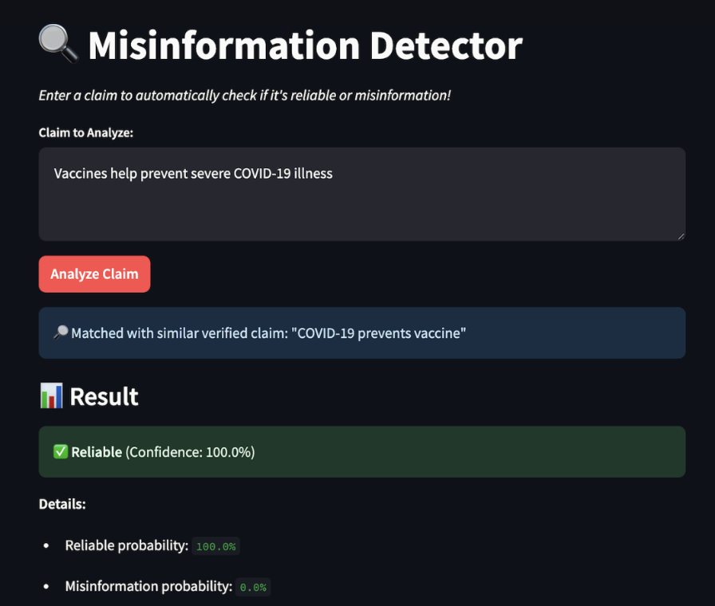
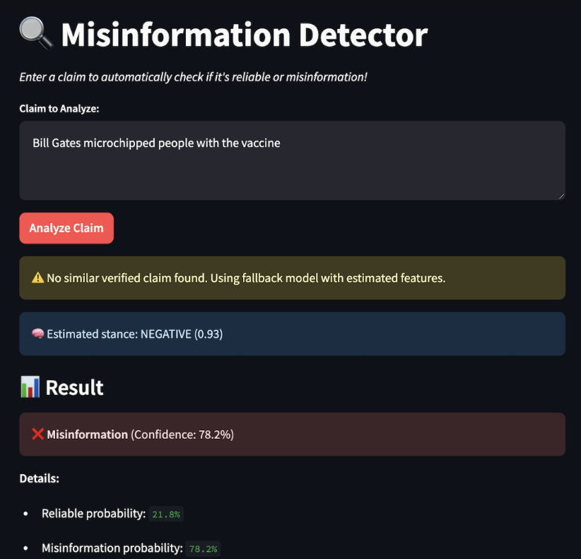

# Misinformation Detector – Real-Time AI Claim Verification

This project is a real-time, explainable system designed to detect **misinformation in AI-generated text**. It combines the power of **LLMs (like GPT-3.5)** with **fact-checking APIs**, **knowledge graph queries**, and **semantic similarity models** to classify claims as either **Reliable** or **Misinformation**, along with a confidence score and detailed breakdown of reasoning.

**Live Demo**: [Watch the 5-minute project demo on YouTube]([https://youtu.be/-CFxmBYdRyM?si=Li5cp1067pwhGuC7])

---

## Features

- Claim-level misinformation detection
- LLM-based semantic similarity (Sentence-BERT)
- Stance detection using DistilBERT sentiment analysis
- Fall-back logic when claims are novel or unseen
- Real-time classification via Streamlit app
- Detailed explanation of predictions (stance, source quality, similarity)
- Preloaded reliable claim set + Phase 5 embeddings

---

## Demo Screenshots

| Reliable Claim | Misinformation |
|----------------|----------------|
|  |  |

---

## How It Works

1. **Input Claim**  
   The user submits a natural-language factual claim.

2. **Semantic Matching & Verification**  
   System checks similarity to known verified claims and searches knowledge bases.

3. **Fallback Model**  
   The system estimates stance, semantic consistency, and source quality if no match is found.

4. **Classification**  
   Outputs a label: `Reliable` ✅ or `Misinformation` ❌ with confidence %.

5. **Explainability**  
   Shows why the claim was classified that way (stance score, source quality, etc.).

---

## Getting Started Locally

### Installation

1. Clone the repository:
   ```bash
   git clone https://github.com/your-username/misinformation-detector.git
   cd misinformation-detector
   ```

2. Create a virtual environment and activate it:
   ```bash
   python -m venv venv
   source venv/bin/activate  # On Windows: venv\Scripts\activate
   ```

3. Install dependencies:
   ```bash
   pip install -r requirements.txt
   ```

4. Place the following model and data files in the root directory:
   - `production_model_v2.pkl`
   - `phase5_claims.json`
   - `phase5_embeddings.npy`

### Run the App
```bash
streamlit run app.py
```
Then visit `http://localhost:8501` in your browser.

---

## File Structure

```bash
.
├── app.py                     # Streamlit app entry point
├── requirements.txt           # Python dependencies
├── production_model_v2.pkl    # Trained classifier model
├── phase5_claims.json         # Pre-verified claims with metadata
├── phase5_embeddings.npy      # Embeddings for phase 5 verified claims
├── screenshots/               # App screenshots for README
└── README.md
```

---

## Tech Stack

- **Streamlit** – for interactive web app
- **Transformers (HuggingFace)** – for stance detection
- **Sentence-BERT (SBERT)** – for semantic similarity
- **scikit-learn** – for final classification
- **Wikidata / DBPedia** – for future knowledge graph integration

---

## Acknowledgements

- OpenAI GPT-3.5 (for claim extraction & guidance)
- HuggingFace Transformers
- Streamlit for fast UI development
- FEVER, LIAR datasets for reference
- Course: **CS 6375 – Machine Learning**  
  **Instructor:** Dr. Wei Yang  
  **Institution:** The University of Texas at Dallas

---

## License

This project is for educational purposes only. All data and model outputs are used in accordance with academic fair use.
